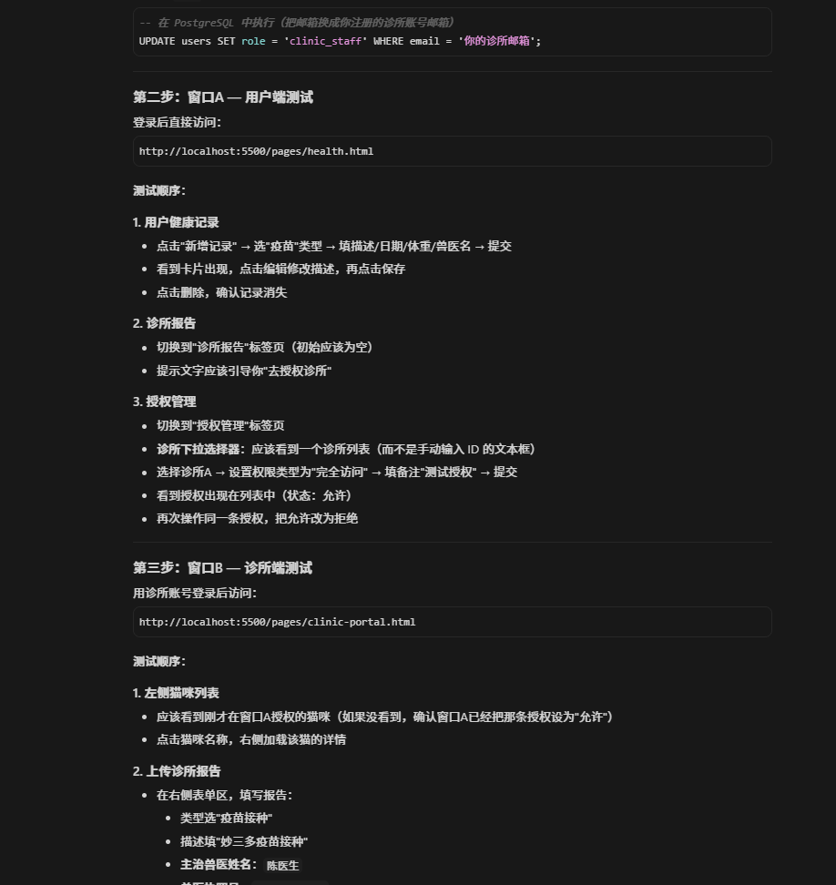

# Member 5 
> 维护人：Member 5（Pan Cheng）
> 分支：`pc-feature/health`
> 最后更新：2026-04-18（测试基础设施 + 前端优化）

---

## 本次会话：医疗信息互通功能设计

### 一、需求理解

用户目标：构建一套让猫主人快速与兽医沟通猫咪医疗信息的系统，核心是**信息的权威性**和**跨机构流通性**。

用户需求拆解为两个核心角色：

| 角色 | 需求 |
|------|------|
| 猫主人（普通用户） | 快速记录猫猫的医疗信息（驱虫、疫苗等），以便在问诊时快速展示 |
| 诊所/兽医 | 使用权威的报告格式（如雷瑟医学检验报告）给用户发送专业报告 |
| 猫主人 | 将从一家医院获得的报告**授权**给另一家医院查阅，实现信息互通 |

---

### 二、现有系统能力分析

通过代码审查，现有系统已具备以下能力：

#### 2.1 用户健康记录（`OwnerHealthRecord`）

**表结构**：已支持疫苗、驱虫、体检、治疗、手术、其他六种类型，含日期、下次提醒日期、体重、兽医名、诊所名、附件URL。

**现有 API**：
- `GET /api/health/records/:catId` — 获取全部健康数据
- `POST /api/health/records/:catId` — 新增用户健康记录
- `PUT /api/health/records/:recordId` — 修改记录
- `DELETE /api/health/records/:recordId` — 删除记录

**前端页面**：`health.html` — 已有健康护照卡片、三标签页（用户记录/诊所报告/授权管理）、附件上传。

#### 2.2 诊所报告（`ClinicHealthReport`）

**表结构**：由诊所上传的官方报告，含类型（疫苗接种/驱虫/体检/血液检验/治疗/手术/其他）、描述、附件URL、日期，关联诊所机构。

**现有 API**：
- `GET /api/clinic/cats` — 诊所获取已授权猫咪列表
- `POST /api/clinic/reports/:catId` — 上传官方报告（含授权校验）
- `PUT /api/clinic/reports/:reportId` — 修改报告
- `DELETE /api/clinic/reports/:reportId` — 删除报告

**前端页面**：`clinic-portal.html` — 左右双栏布局，诊所可查看授权猫咪及其主人记录，上传认证报告。

#### 2.3 授权机制（`HealthSharePermission`）

**表结构**：猫主人对特定诊所的授权记录（`is_allowed` 布尔值），`cat_id + org_id` 联合唯一约束。

**现有 API**：
- `GET /api/health/share/:catId` — 查看某猫的诊所授权列表
- `POST /api/health/share` — 设置/更新授权（upsert 逻辑）

**授权流程**：猫主人在 `health.html` 输入诊所ID并设置允许/拒绝。

#### 2.4 权限分层

| 记录来源 | 创作者 | 查看权限 | 修改权限 |
|----------|--------|----------|----------|
| 用户记录（OwnerHealthRecord） | 猫主人 | 猫主人 + 已授权诊所 | 猫主人 |
| 诊所报告（ClinicHealthReport） | 诊所 | 猫主人 + 所属诊所 | 所属诊所 |

---

### 三、功能扩展方案

现有系统已覆盖**用户自记录**和**诊所上传报告**的基础能力，但存在以下缺口：

#### 3.1 缺口分析与补充方案

| 缺口 | 现状 | 补充方案 |
|------|------|----------|
| **诊所端上传报告时无附件功能** | `POST /api/clinic/reports` 支持 `file_url`，但诊所门户 `clinic-portal.html` 的上传表单没有文件上传 UI | 在诊所门户添加文件上传按钮，复用现有的 `/api/health/upload` 接口 |
| **用户无法选择诊所（需手动输入ID）** | 授权表单需要用户手动输入诊所ID，容易出错 | 新增 `GET /api/organizations?type=clinic` 诊所列表 API，用户在前端从下拉列表选择 |
| **报告格式不够专业/权威** | 诊所报告仅是文本描述 + 附件 | 设计专业的**医疗报告模板**（HTML打印格式），诊所可生成带机构水印的标准化报告 |
| **跨诊所信息传递缺少通知机制** | 用户授权后，诊所端需要手动刷新列表才知道有新授权 | 增加**实时通知**（或轮询检查授权变化），可选后续实现 |
| **用户自记录缺少专业背书能力** | 用户自己填写的记录，前端显示"用户记录"标签，无权威性 | 允许诊所对用户记录"认证"（补充官方说明），或由用户上传从其他机构获取的PDF |

#### 3.2 功能优先级

**第一阶段（本次实现）**：
1. 诊所门户添加附件上传功能
2. 诊所门户添加专业报告模板打印功能
3. 用户端授权表单改为诊所选择器（下拉列表）

**第二阶段（后续迭代）**：
4. 诊所对用户记录添加"官方补充说明"
5. 跨诊所授权自动通知
6. 完整的医学检验报告模板（参考雷瑟格式）

---

### 四、详细实现计划

#### 阶段一：数据层

**数据库变更**（`schema.prisma`）：

```prisma
// ClinicHealthReport 新增字段
model ClinicHealthReport {
  // ... 现有字段
  vet_name         String?   // 主治兽医姓名（本次新增）
  vet_license      String?   // 兽医执照号（本次新增）
  org_name         String?   // 冗余存储诊所名称（报告抬头用，本次新增）
  findings         String?   // 检查发现/结论摘要（本次新增）
  recommendations  String?   // 医嘱/建议（本次新增）
}

// HealthSharePermission 新增字段
model HealthSharePermission {
  // ... 现有字段
  permission_type  SharePermissionType @default(full)  // 授权类型：full=完全访问, read_only=仅查看（本次新增）
  expires_at       DateTime?            // 授权过期时间（本次新增，可选）
  note             String?              // 用户备注（如"用于第二家医院问诊"）（本次新增）
}

enum SharePermissionType {
  full      // 完全访问（含历史记录）
  read_only // 仅查看，不允许上传报告
}
```

**新增 API**：

| Method | 路径 | 说明 | 权限 |
|--------|------|------|------|
| GET | `/api/organizations?type=clinic` | 获取所有诊所列表（供用户选择授权诊所） | 公开 |
| POST | `/api/clinic/reports/:catId/verify` | 诊所对用户记录添加官方认证/补充 | clinic_staff |
| GET | `/api/clinic/permissions` | 诊所端查看自己的所有授权（含历史） | clinic_staff |

#### 阶段二：后端 API 实现

**新增 Controller 函数**（`clinic.controller.js`）：

```javascript
// 1. 获取诊所授权列表（含统计）
async function getClinicPermissions(req, res)

// 2. 诊所对用户健康记录添加官方认证
async function verifyOwnerRecord(req, res)

// 3. 生成标准化医疗报告 PDF 视图（返回 HTML，支持打印）
async function generateReport(req, res)
```

**新增 Controller 函数**（`health.controller.js`）：

```javascript
// 1. 获取诊所列表（过滤 type=clinic）
async function getClinicList(req, res)

// 2. 精细化授权（带权限类型和过期时间）
async function setHealthSharePermissionV2(req, res)
```

#### 阶段三：前端实现

**health.html 升级**：
- 授权管理标签页：从手动输入诊所ID改为诊所下拉选择器
- 新增授权类型选择（完全访问 / 仅查看）
- 新增授权过期时间设置
- 新增授权备注字段
- 诊所报告区域增加"专业报告"打印按钮

**clinic-portal.html 升级**：
- 上传报告表单新增：主治兽医姓名、兽医执照号、检查结论、医嘱建议
- 上传报告表单新增：文件上传按钮（支持图片/PDF）
- 新增"生成专业报告"按钮（调用报告模板）
- 新增"授权猫咪"统计面板

**新增页面**：`clinic-report-print.html`
- 专业的医疗报告打印模板
- 含机构Logo、报告编号、日期、猫猫信息、检查结果、医嘱
- 支持浏览器打印（Ctrl+P）或另存为PDF

---

### 五、报告模板设计（雷瑟医学风格）

参考雷瑟医学检验报告的格式，设计标准化猫咪医疗报告：

```
┌─────────────────────────────────────────────────────────────┐
│  🏥 [诊所名称]                                              │
│  [诊所地址] | [联系电话]                                    │
├─────────────────────────────────────────────────────────────┤
│  宠物医疗报告 / PET MEDICAL REPORT                          │
├─────────────────────────────────────────────────────────────┤
│  报告编号：RPT-2026-00123     生成日期：2026-04-17          │
├───────────────────────┬─────────────────────────────────────┤
│  宠物信息             │  主人信息                           │
│  ───────────────     │  ───────────────                    │
│  名字：小白           │  姓名：张三                         │
│  品种：中华田园猫     │  联系方式：0912-345-678             │
│  年龄：24个月         │                                    │
│  性别：公            │                                    │
│  体重：4.5 kg        │                                    │
├───────────────────────┴─────────────────────────────────────┤
│  主治兽医：[兽医姓名]                                       │
│  执照号：[执照编号]                                         │
├─────────────────────────────────────────────────────────────┤
│  报告类型：[类型标签]                                       │
├─────────────────────────────────────────────────────────────┤
│  检查结论 / FINDINGS                                        │
│  ─────────────────────────────────────────────────────────  │
│  [详细描述...]                                             │
│                                                             │
├─────────────────────────────────────────────────────────────┤
│  医嘱建议 / RECOMMENDATIONS                                 │
│  ─────────────────────────────────────────────────────────  │
│  [医嘱内容...]                                             │
│                                                             │
├─────────────────────────────────────────────────────────────┤
│  附件：[附件文件名]                                         │
└─────────────────────────────────────────────────────────────┘
```

---

### 六、跨诊所授权流程（完整时序）

```
用户（第一家医院获取报告）
    │
    ▼
1. 在平台上查看自己的诊所报告
    │
    ▼
2. 进入"授权管理"，选择第二家诊所
    - 选择诊所（从下拉列表）
    - 选择权限类型（完全访问/仅查看）
    - 设置过期时间（可选）
    - 添加备注（"用于问诊"）
    │
    ▼
3. 第二家诊所登录诊所门户
    │
    ▼
4. 在授权猫咪列表中看到新增授权的猫
    │
    ▼
5. 点击猫咪，可查看：
    - 该猫的全部主人自记录
    - 第一家诊所上传的所有报告
    - 其他已授权诊所的报告
    │
    ▼
6. 第二家诊所可上传自己的报告
    │
    ▼
7. 用户在健康页面看到来自两家诊所的报告
```

---

### 七、待实现清单

| # | 任务 | 类型 | 优先级 |
|---|------|------|--------|
| 1 | `schema.prisma` 新增字段（vet_name, vet_license, findings, recommendations, permission_type, expires_at, note） | 数据库 | P0 |
| 2 | `prisma migrate dev` 生成迁移文件 | 数据库 | P0 |
| 3 | `GET /api/organizations?type=clinic` 诊所列表 API | 后端 | P0 |
| 4 | `clinic-portal.js` 添加文件上传到报告上传流程 | 前端 | P1 |
| 5 | `health.js` 授权表单改为诊所下拉选择器 | 前端 | P1 |
| 6 | `clinic-report-print.html` 专业报告打印模板 | 前端 | P1 |
| 7 | `POST /api/clinic/reports/:catId` 支持更多字段（findings, recommendations, vet_name, vet_license） | 后端 | P1 |
| 8 | 诊所端精细化授权管理（GET /api/clinic/permissions） | 后端 | P2 |
| 9 | 诊所对用户记录添加官方认证（POST /api/clinic/reports/:catId/verify） | 后端 | P2 |

---

### 八、文件变更清单

本次功能涉及以下文件的新建/修改：

**新建文件**：无（报告模板已集成在后端 API 中，无需独立 HTML）

**修改文件**：
- `backend/prisma/schema.prisma` — 新增 `SharePermissionType` 枚举、`ClinicRecordEndorsement` 表、报告扩展字段
- `backend/src/controllers/health.controller.js` — 诊所列表 API、精细化授权、记录含认证信息
- `backend/src/controllers/clinic.controller.js` — 报告扩展字段、认证 API、报告生成、诊所权限统计
- `backend/src/routes/health.routes.js` — 新增 `GET /api/health/clinics`
- `backend/src/routes/clinic.routes.js` — 新增认证、查看、统计路由
- `frontend/pages/health.html` — 授权选择器升级、诊所报告列印引导
- `frontend/pages/clinic-portal.html` — 报告扩展表单、认证弹窗、统计面板
- `frontend/js/health.js` — 诊所选择器、认证徽章、列印功能
- `frontend/js/clinic-portal.js` — 附件上传、认证弹窗、列印、统计更新

---

> 日志结束，下次继续实现时从此文件顶部"最后更新"行开始。

---

## 第二/三阶段实施日志（2026-04-17）

### 阶段二：诊所认证功能

#### 数据库
- 新增 `ClinicRecordEndorsement` 表 — 诊所对用户健康记录的官方认证，含 `record_id`、`org_id`、`endorsement`（认证说明）、`note`（备注），`record_id + org_id` 联合唯一约束

#### 后端 API
| 接口 | 说明 |
|------|------|
| `GET /api/clinic/records/:recordId` | 诊所查看单条用户健康记录详情（含认证状态） |
| `POST /api/clinic/records/:recordId/endorse` | 诊所对用户记录添加/更新官方认证（upsert） |
| `GET /api/health/records/:catId` | 用户获取记录时自动包含诊所认证信息（`endorsements` 嵌套） |

#### 前端
- **health.html** — 用户端记录卡片显示诊所认证徽章（诊所名 + 认证内容 + 备注）
- **clinic-portal.html** — 主人记录区新增认证弹窗 Modal
- **clinic-portal.js** — 认证弹窗逻辑（`openEndorseModal` / `closeEndorseModal`）、缓存主人记录数据

### 阶段三：完善与体验优化

#### 用户端（health.html）
- 诊所报告卡片新增：主治兽医标签、检查结论、医嘱建议、兽医执照号、列印按钮
- 新增 `window.printReport(reportId)` — 调用后端生成专业报告 HTML 并在新窗口打开
- 提示文字更新，引导用户使用列印功能

#### 诊所端（clinic-portal.html）
- 诊所 Header 统计面板扩展：已授权病患数 + 已上传报告数 + 已认证记录数
- 主人记录区域增加「✅ 添加认证」或「✏️ 更新认证」按钮

#### 后端优化
- `generateReportPrint` — 报告模板增加兽医执照号、检查结论、医嘱建议字段渲染
- `getClinicPermissions` — 新增 `stats` 统计数据（总数/活跃/过期/待处理）

#### 变量修复
- `health.js` — 修复 `clinicList` 变量名冲突（原同时作为 DOM 元素和诊所数组使用）

### 文件变更汇总（本次会话）

| 操作 | 文件 |
|------|------|
| 修改 | `backend/prisma/schema.prisma` |
| 修改 | `backend/src/controllers/health.controller.js` |
| 修改 | `backend/src/controllers/clinic.controller.js` |
| 修改 | `backend/src/routes/health.routes.js` |
| 修改 | `backend/src/routes/clinic.routes.js` |
| 修改 | `frontend/pages/health.html` |
| 修改 | `frontend/pages/clinic-portal.html` |
| 修改 | `frontend/js/health.js` |
| 修改 | `frontend/js/clinic-portal.js` |
| 修改 | `MEMBER5_WORKLOG.md` |

---

## 第四阶段实施日志（2026-04-18）

### 阶段四：测试基础设施与前端体验优化

本次会话聚焦于构建可重复执行的测试流程，以及对前端交互体验的打磨。

#### 4.1 自动化 API 测试脚本

**新建文件**：`backend/test_health_apis.js`

独立可执行的 Node.js 测试脚本，覆盖以下场景：

| 测试组 | 覆盖场景 | 说明 |
|--------|---------|------|
| Auth | 普通用户登录 / 诊所用户登录 | 通过获取 token，供给后续接口使用 |
| Health Records | 创建记录 / 获取记录 / 更新记录 / 删除记录 | CRUD 全流程 |
| Clinic Reports | 诊所上传报告 / 获取报告 / 更新 / 删除 | `clinic_staff` 角色权限校验 |
| Report Print | 报告打印模板生成 | 验证 HTML 模板渲染 |
| Endorsement | 诊所认证用户记录 | upsert 逻辑 |
| Permissions | 授权管理 | 授权/取消授权、精细化权限 |

**特点**：
- 脚本内置测试数据（邮箱、密码、猫咪 ID、诊所 ID）
- 按顺序执行，前置步骤失败则后续跳过
- 彩色控制台输出，清晰展示每个测试的通过/失败状态
- 启动方式：`node test_health_apis.js`（位于 `backend/` 目录）

#### 4.2 诊所注册/登录响应格式统一

**修复文件**：`backend/src/controllers/auth.controller.js`

原问题：诊所注册和登录接口返回的字段结构不一致（`data.user` vs `data.rescue_staff_user`），导致前端 `clinic-portal.js` 需要写两套兼容逻辑。

已统一为 `data.rescue_staff_user` 和 `data.organization` 格式。

#### 4.3 诊所认证功能（续）

**完善文件**：`frontend/js/clinic-portal.js`

- 新增 `cachedOwnerRecords` 缓存变量，避免重复请求
- 主人记录区域正确显示诊所认证状态（已认证 / 未认证）
- 认证按钮文案动态切换：「✅ 添加认证」或「✏️ 更新认证」
- 认证成功后刷新猫咪详情，保持数据同步

**完善文件**：`frontend/js/health.js`

- 主人健康记录卡片中渲染诊所认证徽章（诊所名 + 认证内容 + 备注）
- 支持同一记录可被多个诊所分别认证（多个 `endorsements` 数组项）
- 认证徽章样式：`background:#e9faf2; border:1px solid #a7f3d0`

#### 4.4 专业报告打印模板完善

**优化文件**：`backend/src/controllers/clinic.controller.js` — `generateReportPrint` 函数

报告模板新增/优化以下字段的渲染：

| 字段 | 说明 |
|------|------|
| 报告编号 | `RPT-{年份}-{UUID前8位}` 格式 |
| 主治兽医姓名 | `vet_name` |
| 兽医执照编号 | `vet_license` |
| 检查结论摘要 | `findings` — 独立区块展示 |
| 医嘱建议 | `recommendations` — 独立区块展示 |
| 附件链接 | `file_url` — 底部附件区，点击可打开附件 |

打印模板样式：深蓝色 header、专业的分栏布局、支持浏览器 Ctrl+P 打印。

#### 4.5 前端体验优化

**health.html — 用户端**：
- 诊所报告卡片新增：主治兽医标签、检查结论、医嘱建议、兽医执照号、列印按钮
- 新增 `window.printReport` 快捷调用
- 健康护照（Passport）动态汇总最新疫苗/驱虫/手术/体重记录

**clinic-portal.html — 诊所端**：
- 诊所 Header 统计面板扩展：已授权病患数 + 已上传报告数 + 已认证记录数（认证统计预留）
- 主人记录区域增加「✅ 添加认证」或「✏️ 更新认证」按钮
- 上传报告表单新增：主治兽医姓名、兽医执照号、检查结论、医嘱建议
- 上传报告表单新增文件上传按钮（图片/PDF 附件）

#### 4.6 数据库层

**schema.prisma**（无新增变更），现有结构已完整支持本次功能：
- `OwnerHealthRecord` — 含 `file_url` 附件字段
- `ClinicHealthReport` — 含 `findings`、`recommendations`、`vet_name`、`vet_license` 等扩展字段
- `ClinicRecordEndorsement` — 诊所对用户记录的官方认证
- `HealthSharePermission` — 精细化授权，含 `permission_type`（full / read_only）、`expires_at`、`note`

#### 4.7 新建文件清单

| 文件 | 说明 |
|------|------|
| `backend/test_health_apis.js` | 自动化 API 测试脚本（Node.js） |
| `docs/MEMBER5_HEALTH_TEST_GUIDE.md` | 完整的测试指南文档 |
| `docs/image/MEMBER5_HEALTH_TEST_GUIDE/` | 测试截图（7张） |

---

### 文件变更汇总（2026-04-18）

| 操作 | 文件 |
|------|------|
| 新建 | `backend/test_health_apis.js` |
| 新建 | `docs/MEMBER5_HEALTH_TEST_GUIDE.md` |
| 新建 | `docs/image/MEMBER5_HEALTH_TEST_GUIDE/` 目录下7张截图 |
| 修改 | `backend/src/controllers/auth.controller.js` |
| 修改 | `backend/src/controllers/clinic.controller.js` |
| 修改 | `backend/src/controllers/health.controller.js` |
| 修改 | `backend/src/routes/clinic.routes.js` |
| 修改 | `frontend/pages/health.html` |
| 修改 | `frontend/pages/clinic-portal.html` |
| 修改 | `frontend/js/health.js` |
| 修改 | `frontend/js/clinic-portal.js` |
| 修改 | `MEMBER5_WORKLOG.md` |

---

### 下一步待办

| # | 任务 | 类型 | 优先级 |
|---|------|------|--------|
| 1 | 跨诊所授权自动通知（WebSocket / 轮询） | 前端 | P2 |
| 2 | 诊所对用户记录添加官方背书（补充说明字段） | 后端 | P2 |
| 3 | 完整的医学检验报告模板（参考雷瑟格式） | 前端 | P2 |
| 4 | 诊所端精细化授权管理 UI | 前端 | P2 |
| 5 | 通知系统集成（健康记录变动通知） | 后端 | P2 |

> 日志结束，下次继续实现时从此文件顶部"最后更新"行开始。
